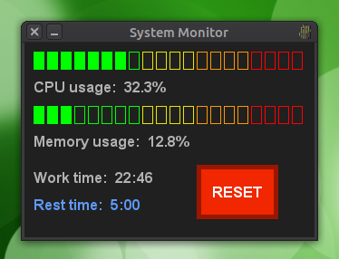
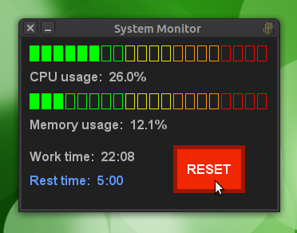

# System Monidoro
## As system monitor/pomodoro timer widget built in Python

### About:
This sprang into being from difficulty finding a system monitor and pomodoro timer that I liked and a desire to play with the pygame Python package. It was also an opportunity to play with classes and do a little bit of object oriented programming.

### Starting and stopping the monitor:

The repo can be cloned by navigating to the directory of your choosing by running the command below.
```
$ git clone https://github.com/nickbuker/system_monidoro_widget.git
```
The requirements to run the monitor can be installed using the command below. Use of a virtual environment is encouraged.
```
$ pip install -r requirements.txt
```
The monitor can be started by navigating to the root directory of this repo and running the command below.
```
$ python SystemMonidoro.py
```
The monitor can be stoped by hitting cmd-c or control-c in the terminal running the application or by clicking the close window button on the top bar of the monitor.

### Monitor elements:
The monitor provides both visual and text information about CPU and memory usage. Work time is the amount of time remaining in the pomodoro work cycle. Rest time is the about of time in the break. Once the work time is exhausted, the monitor beeps 5 times and the rest time starts counting down. Once the rest time has run out, it continues to track time beyond the end of the break (negative rest time).


 
### Resetting timer:
The timer can be reset by clicking the reset button. You should hear a click sound and the timer should reset to work time 25:00 and rest time 5:00.

